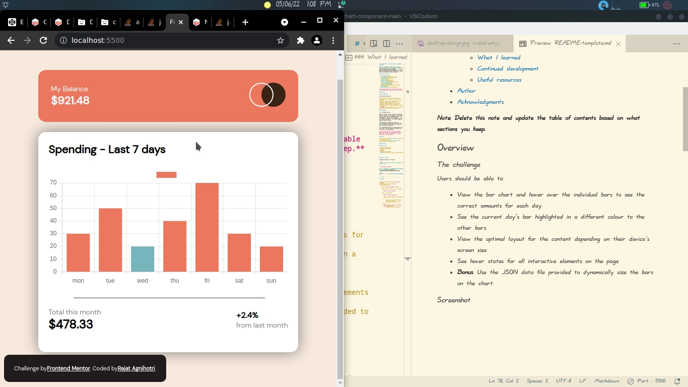

# Frontend Mentor - Expenses chart component solution

This is a solution to the [Expenses chart component challenge ](https://codepen.io/rajatag26523250/pen/BaYPNRL?editors=1010). Frontend Mentor challenges help you improve your coding skills by building realistic projects.

## Table of contents

- [Overview](#overview)
  - [The challenge](#the-challenge)
  - [Screenshot](#screenshot)
  - [Links](#links)
- [My process](#my-process)
  - [Built with](#built-with)
  - [What I learned](#what-i-learned)
  - [Continued development](#continued-development)
  - [Useful resources](#useful-resources)
- [Author](#author)
- [Acknowledgments](#acknowledgments)

**Note: Delete this note and update the table of contents based on what sections you keep.**

## Overview

### The challenge

Users should be able to:

- View the bar chart and hover over the individual bars to see the correct amounts for each day
- See the current day’s bar highlighted in a different colour to the other bars
- View the optimal layout for the content depending on their device’s screen size
- See hover states for all interactive elements on the page
- **Bonus**: Use the JSON data file provided to dynamically size the bars on the chart

### Screenshot





Add a screenshot of your solution. The easiest way to do this is to use Firefox to view your project, right-click the page and select "Take a Screenshot". You can choose either a full-height screenshot or a cropped one based on how long the page is. If it's very long, it might be best to crop it.

Alternatively, you can use a tool like [FireShot](https://getfireshot.com/) to take the screenshot. FireShot has a free option, so you don't need to purchase it. 

Then crop/optimize/edit your image however you like, add it to your project, and update the file path in the image above.

**Note: Delete this note and the paragraphs above when you add your screenshot. If you prefer not to add a screenshot, feel free to remove this entire section.**

### Links

- Solution URL: [Add solution URL here](https://your-solution-url.com)
- Live Site URL: [Add live site URL here](https://your-live-site-url.com)

## My process

### Built with

- Semantic HTML5 markup
- CSS custom properties
- Flexbox
- CSS Grid
- Mobile-first workflow
- [Chartjs](https://www.chartjs.org/docs/latest/)


### What I learned

Intializing Chart Js in Project

```jsx
<script src="https://cdn.jsdelivr.net/npm/chart.js"></script>
```

> **Creating new Chart**

[https://codepen.io/rajatag26523250/pen/BaYPNRL?editors=1010](https://codepen.io/rajatag26523250/pen/BaYPNRL?editors=1010)

```js
const chart  = new Chart(document.getElementById(

'my-chart'

),config);
```

- here first parameter takes the **target el**ement,
- second parameter takes **config (**configuration**)**
    
    config **at bare minimum** includes :
    
    - type: ‘type of chart’ ie. bar, line,pie
        
        **type : mostly string**
        
    - data : take dataset
        
        **type : array of objects**
        
        - these objects generally includes data like:
            
             labels,data (include data about how to draw graph),background-color,border-color
            
    - options:
        - may include eventHandler(**onClick=(event,element)={}**)
            - responsiveness and many more.


